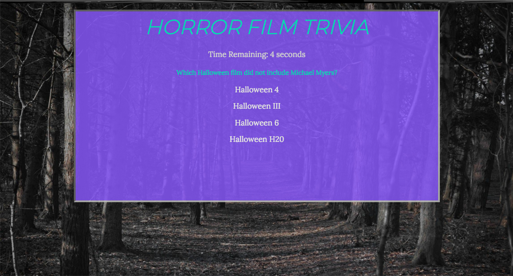

# HORROR FILM TRIVIA 😱🔪

Think you know slasher films? Try your shot at this multiple-choice trivia game made with JavaScript, jQuery, HTML, and CSS.

🚀 Deployed at: http://harpalassi.github.io/Horror-Trivia-Game

## Functionality

This was an exercise in using JavaScript timers and interval functions to create a countdown for each question. There are eight questions and the user has ten seconds to answer each one or they will not get credit. After the game is over, the scores will be tallied (correct, incorrect, unanswered) and presented as a percentage to the user.

## Built With

- CSS3
- HTML5
- JavaScript
- jQuery
- Bootstrap 4
